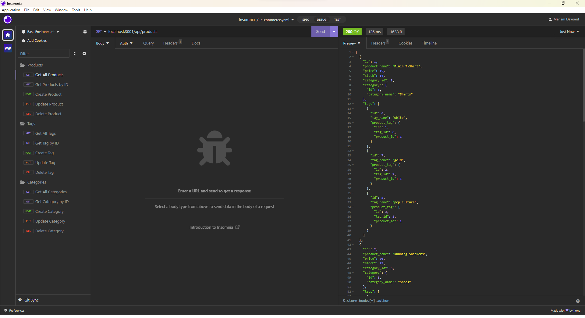
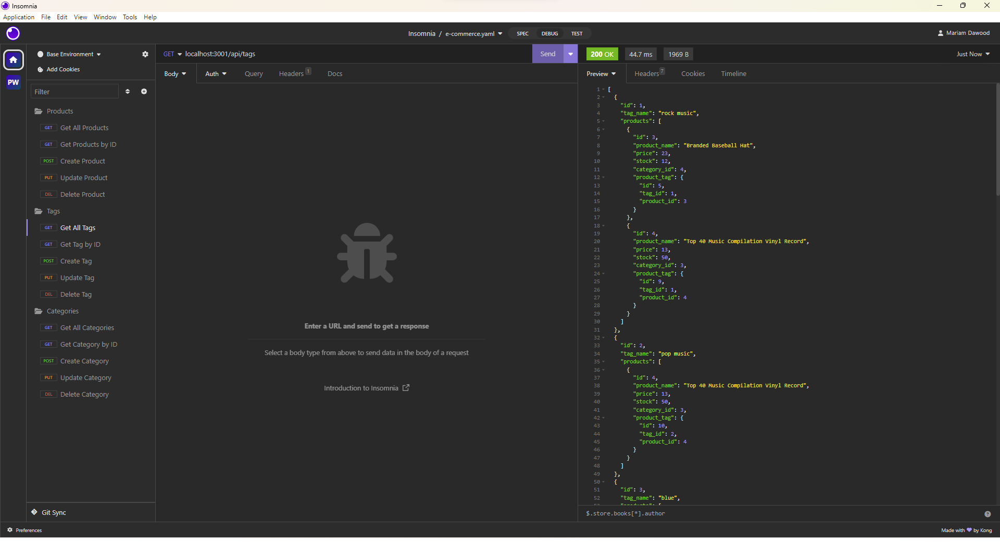
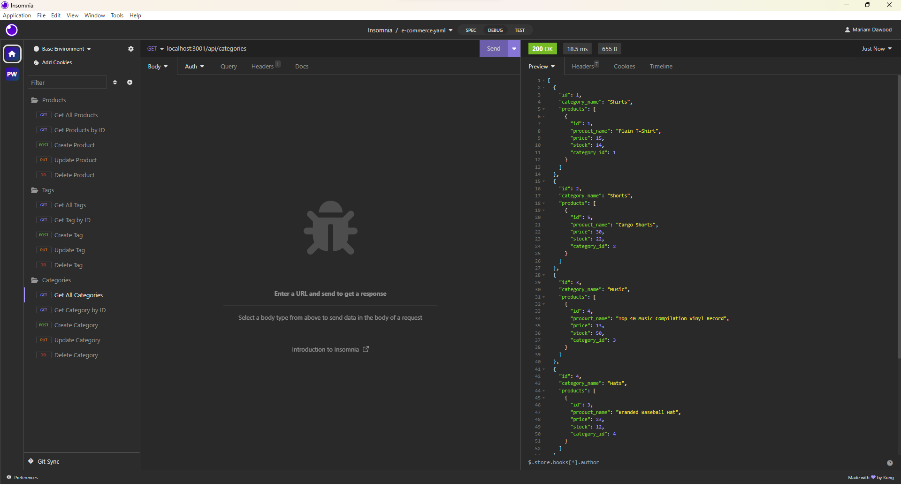

# E-commerce Back End ORM 

## Description
This application is a back end for an e-commerce website built using Express.js and Sequelize to interact with a MySQL database. It includes API routes for managing tags, products, and categories. The application ensures secure data handling with environment variables for sensitive information and establishes model associations for seamless data relationships. The provided walkthrough video demonstrates the functionality, including database schema creation, seeding, and API testing using Insomnia.

## Walkthrough Video
[E-commerce Back End ORM](https://drive.google.com/file/d/1_luKgkt8B40mtiSJ8HE1CjULAXsL_PmP/view?usp=drive_link)

## Screenshot

## Table of Contents
- [Installation](#installation)
- [Usage](#usage)
- [Test](#test)
- [Contributor Guidelines](#contributor-guidelines)
- [Credits](@credits)
- [License](#license)
- [Questions](#questions)

## Installation
- Clone repository
- Run 'npm install' to install required dependencies.
- Run 'mpm install nodemon@latest mysql2@latest sequelize@latest dotenv@latest' to install required packages.
- Update the 'config/connection.js' file with your MySQL details.
- Open your terminal, log in to MySQL with 'mysql -u your_username -p', and enter your MySQL password.
- In MySQL, import the database schema using 'source db/schema.sql;'.
- Exit MySQL using 'EXIT;"
- Seed the database with initial data by running 'npm run seed'.

## Usage
- Connect to server by running 'npm start'.
- Test API on Insomnia.

## Test
Please follow installation process followed by usage.

## Contributor Guidelines

## Credits
None.

## License

This project is licensed under the [MIT](https://opensource.org/licenses/MIT) license.

## Questions

For any questions or additional information, please contact me:
- [Email](mailto:mariam.miladd@gmail.com?subject=[GitHub]%20Dev%20Connect)
- [GitHub](https://github.com/mariamdawood)